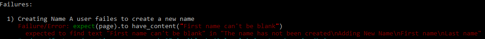

Creating Names
==================================================


## Table of Content
1. [Create git feature branch](#create-git-feature-branch)
2. [Create RSpec feature specification with successful scenario](#create-rspec-feature-specification-with-successful-scenario)
  1. [Add root path to the route file](#add-root-path-to-the-route-file)
  2. [Generate the controller](#generate-the-controller)
  3. [Add new link from index view](#add-new-link-from-index-view)
  4. [Add resources to the route file](#add-resources-to-the-route-file)
  5. [Add new action to the controller](#add-new-action-to-the-controller)
  6. [Create the new view](#create-the-new-view)
  7. [Add instance variable to the controller](#add-instance-variable-to-the-controller)
  8. [Generate the model](#generate-the-model)
  9. [Add create action to the controller](#add-create-action-to-the-controller)
  10. [Add flash to the application](#add-flash-to-the-application)
3. [Update RSpec feature specification with negative scenario](#update-rspec-feature-specification-with-negative-scenario)
  1. [Add validation to the model](#add-validation-to-the-model)
  2. [Display validation errors](#display-validation-errors)
4. [Commit changes and merge into master branch](#commit-changes-and-merge-into-master-branch)


## Create a feature branch
Create a git feature branch.
```bash
git checkout -b creating-name
```

## Create feature specification with successful scenario
Create a new file called _creating_name_spec.rb_ and make sure it starts with the line `require "rails_helper"`. Add the steps and the expected results from the actions.
```ruby
require "rails_helper"

RSpec.feature "Creating Name" do
  scenario "A user creates a new name" do
    visit "/"

    click_link "Create name"

    fill_in "First Name", with: "Adam"
    fill_in "Last Name", with: "Alpha"
    click_button "Create Name"

    expect(page).to have_content("The name has been created")
    expect(page.current_path).to eq(root_path)
  end
end
```

Run RSpec and address each error as they occur.
```bash
rspec spec/features/creating_name_spec.rb
```

### Add root path to the route file
The first error states:
```bash
Failure/Error: visit "/"
ActionController::RoutingError:
  No route matches [GET] "/"
```


To address this, create a _root path_ by updating the _config/routes.rb_ file
```ruby
root to: "names#index"
```

### Generate the controller
Running RSpec again gives us the next error:
```bash
Failure/Error: visit "/",
ActionController::RoutingError:
  uninitialized constant NamesController
```


To address this, create a controller using a generator
```bash
rails g controller names index
```

Remove the _get 'names/index'_ line from the _config/routes.rb_ file


### Add new link from index view
Running RSpec again gives us the next error:
```bash
Failure/Error: click_link "New Name"
Capybara::ElementNotFound:
  Unable to find link "New Name"
```


To address this, update the file _app/views/names/index.html.erb_ by removing the existing content and add a link to _new_name_path_.
```ruby
<%= link_to "New Name", new_name_path %>
```


### Add resources to the route file
Running RSpec again gives us the next error:
```bash
Failure/Error: <%= link_to "New Name", new_name_path %>
ActionView::Template::Error:
  undefined local variable or method 'new_name_path'
```


To address this, add `resources` to the _config/routes.rb_ file
```ruby
resources :names
```

### Add the new action to the controller
Running RSpec again gives us the next error:
```bash
Failure/Error: click_link "New Name"
AbstractController::ActionNotFound:
  The action "new" could not be found for NamesController"
```


To address this, add the `new` action for the controller, _app/controllers/names_controller.rb_
```ruby
def new
end
```

### Create the new view
Running RSpec again gives us the next error:
```bash
Failure/Error: click_link "New Name"
ActionController::UnknownFormat:
  NamesController#new is missing a template for this request format and variant.
```


To address this, create the file _app/views/names/new.html.erb_. Specific _Bootstrap_ classes are used for styling.

```ruby
<h3 class="text-center">Adding New Name</h3>
<div class="row">
  <div class="col-md-12">
    <%= form_for(@name, :html => {class: "form-horizontal", role: "form"}) do |f| %>
      <div class="form-group">
        <div class="control-label col-md-1">
          <%= f.label :first_name %>
        </div>
        <div class="col-md-11">
          <%= f.text_field :first_name, class: "form-control", autofocus: true %>
        </div>
        <div class="form-group">
          <div class="control-label col-md-1">
            <%= f.label :last_name %>
          </div>
          <div class="col-md-11">
            <%= f.text_field :last_name, class: "form-control", autofocus: true %>
          </div>
      </div>
      <div class="form-group">
        <div class="col-md-offset-1 col-md-11">
          <%= f.submit "Create Name", class: "btn btn-primary btn-lg pull-right" %>
        </div>
      </div>
    <% end %>
  </div>
</div>
```

### Add instance variable to the controller
Running RSpec again gives us the next error:
```bash
Failure/Error: <%= form_for(@name, :html => {class: "form-horizontal", role: "form"}) do |f| %>
ActionView::Template::Error:
  First argument in form cannot contain nil or be empty
```


To address this, update the `new` action for the controller, _app/controllers/names_controller.rb_ by adding an instance variable.
```ruby
def new
  @name = Name.new
end
```

### Generate the model
Running RSpec again gives us the next error:
```bash
Failure/Error: @name = Name.new
NameError:
  uninitialized constant NamesController::Name
```


To address this, create a model using a generator. __Note__ By convention, model names are singular and controller names are plural.
```bash
rails g model name first_name:string  last_name:string full_name:string
```

Review and update the migration file _db/migrate/[TIMESTAMP]_create_names.rb_ if required. Run the migration to create a database table.
```bash
rails db:migrate
```

### Add create action to the controller
Running RSpec again gives us the next error:
```bash
Failure/Error: click_button "Create Name"
AbstractController::ActionNotFound:
  The action 'create' could not be found for NamesController
```


To address this, add the `create` action for the controller as well as the __private__ `name_params` method
```ruby
def create
  @name = Name.new(name_params)
  if @name.save
    flash[:sucess] = "The name has been created"
    redirect_to root_path
  else
    flash.now[:danger] = "The name has not been created"
    render :new
  end
end

private
  def name_params
    params.require(:name).permit(:first_name, :last_name)
  end
```

### Add flash to the application
Running RSpec again gives us the next error:
```bash
Failure/Error: expect(page).to have_content("Name has been created")
  expected to find text "Name has been created" in "New Name"
```


To address this, add flash messaging to the _app/views/layouts/application.html.erb_ file using _Bootstrap_ classes.
```ruby
<body>
  <% flash.each do |key, message| %>
    <div class="text-center alert alert-<%= key == 'notice'? 'success': 'danger' %>">
      <%= message %>
      </div>
  <% end %>
  <%= yield %>
</body>
```

## Update RSpec feature specification with negative scenario
Update the file _creating_name_spec.rb_ and add a negative scenario.
```ruby
scenario "A user failes to create a new name" do
  visit "/"

  click_link "New Name"

  fill_in "First name", with: ""
  fill_in "Last name", with: ""
  click_button "Create Name"

  expect(page).to have_content("The name has not been created")
  expect(page).to have_content("First name can't be blank")
  expect(page).to have_content("Last name can't be blank")
  expect(page.current_path).to eq(names_path)
end
```

### Add validation to model
Running RSpec gives the error:
```bash
Failure/Error: expect(page).to have_content("Name has been created")
  expected to find text "Name has been created" in "New Name"
```



To address this, update the file _models/name.rb_ to include validation and sort order
```ruby
class Name < ApplicationRecord
  validates :first_name, presence: true
  validates :last_name, presence: true

  default_scope { order(last_name: :desc, first_name: :desc) }
end
```

### Display validation errors
Running RSpec gives the error:
```bash
Failure/Error: expect(page).to have_content("Name has been created")
  expected to find text "Name has been created" in "New Name"
```


It is the same error as before since we are not displaying the errors. To address this, update the _new.html.erb_ file to display the validation errors.
```ruby
<h3 class="text-center">Adding New Name</h3>
<div class="row">
  <div class="col-md-12">
    <%= form_for(@name, :html => {class: "form-horizontal", role: "form"}) do |f| %>
    <% if @name.errors.any? %>
      <div class="panel panel-danger col-md-offset-1">
        <div class="panel-heading">
          <h2 class="panel-title">
            <%= pluralize(@name.errors.count, "error") %>
            prohibited this name from being saved: </h2>
            <div class="panel-body">
              <ul>
                <% @name.errors.full_messages.each do |msg| %>
                <li>
                  <%= msg %>
                </li>
                <% end %>
              </ul>
            </div>
          </div>
        </div>
      <% end %>
```

## Commit the changes and merge into master branch
Check the _Git_ status and commit the updated files.
```bash
git status
git add -A
git commit -m "Implementing creating name functionality"
```

Checkout the _master_ branch and merge the changes.
```bash
git checkout master
git merge creating-name
git push
```

View a colourful log of the git branches and the commits.
```bash
git log --graph --oneline --decorate  
```
