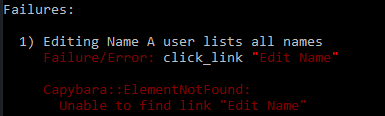
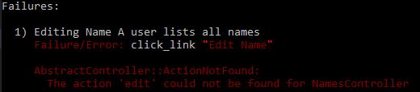
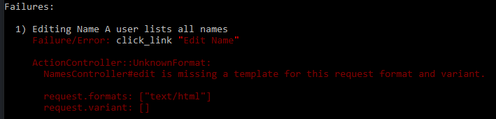
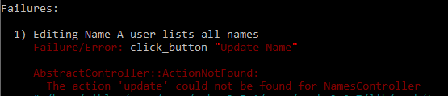
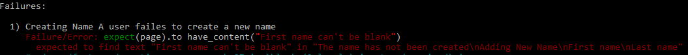

Editing Name
==================================================


## Table of Content
1. [Create git feature branch](#create-git-feature-branch)
2. [Create RSpec feature specification with successful scenario](#create-rspec-feature-specification-with-successful-scenario)
  1. [Add root path to the route file](#add-root-path-to-the-route-file)
  2. [Generate the controller](#generate-the-controller)
  3. [Add new link from index view](#add-new-link-from-index-view)
  4. [Add resources to the route file](#add-resources-to-the-route-file)
  5. [Add new action to the controller](#add-new-action-to-the-controller)
  6. [Create the new view](#create-the-new-view)
  7. [Add instance variable to the controller](#add-instance-variable-to-the-controller)
  8. [Generate the model](#generate-the-model)
  9. [Add create action to the controller](#add-create-action-to-the-controller)
  10. [Add flash to the application](#add-flash-to-the-application)
3. [Update RSpec feature specification with negative scenario](#update-rspec-feature-specification-with-negative-scenario)
  1. [Add validation to the model](#add-validation-to-the-model)
  2. [Display validation errors](#display-validation-errors)
4. [Commit changes and merge into master branch](#commit-changes-and-merge-into-master-branch)


## Create a feature branch
Create a git feature branch.
```bash
git checkout -b editing-name
```

## Create feature specification with successful scenario
Create a new file called _creating_name_spec.rb_ and make sure it starts with the line `require "rails_helper"`. Add the steps and the expected results from the actions.
```ruby
require "rails_helper"
RSpec.feature "Editing Name" do
  before do
    Name.delete_all
    @name = Name.create(first_name: "Adam", last_name: "Alpha")
  end

  scenario "A user lists all names" do
    visit "/"
    click_link ("#{@name.first_name} #{@name.last_name}")

    click_link "Edit Name"
    fill_in "First name", with: "Bertil"
    fill_in "Last name", with: "Bravo"
    click_button "Update Name"

    expect(page).to have_content("Name has been updated")
    expect(page.current_path).to eq(name_path(@name))
  end
end
```

Run RSpec and address each error as they occur.
```bash
rspec spec/features/creating_name_spec.rb
```

### Add new link from index view
Running RSpec gives us the first error:
```bash
Failure/Error: click_link "Edit Name"
Capybara::ElementNotFound:
  Unable to find link "Edit Name"
```


To address this, update the file _app/views/names/show.html.erb_ by adding a link to _edit_name_path_.
```ruby
<%= link_to "Edit Name", edit_name_path(@name), class: "btn btn-primary btn-lg btn-space" %>
```


### Add the new action to the controller
Running RSpec again gives us the next error:
```bash
Failure/Error: click_link "Edit Name"
AbstractController::ActionNotFound:
  The action "edit" could not be found for NamesController"
```


To address this, add the `edit` action for the controller, _app/controllers/names_controller.rb_
```ruby
def edit
  @name = Name.find(params[:id])
end
```

### Create the edit view
Running RSpec again gives us the next error:
```bash
Failure/Error: click_link "Edit Name"
ActionController::UnknownFormat:
  NamesController#new is missing a template for this request format and variant.
```



To address this, create the file _app/views/names/edit.html.erb_. Specific _Bootstrap_ classes are used for styling.

```ruby
<h3 class="text-center">Editing A Name</h3>
<div class="row">
  <div class="col-md-12">
    <%= form_for(@name, :html => {class: "form-horizontal", role: "form"}) do |f| %>
    <% if @name.errors.any? %>
      <div class="panel panel-danger col-md-offset-1">
        <div class="panel-heading">
          <h2 class="panel-title">
            <%= pluralize(@name.errors.count, "error") %>
            prohibited this name from being saved: </h2>
            <div class="panel-body">
              <ul>
                <% @name.errors.full_messages.each do |msg| %>
                <li>
                  <%= msg %>
                </li>
                <% end %>
              </ul>
            </div>
          </div>
        </div>
      <% end %>

      <div class="form-group">
        <div class="control-label col-md-2">
          <%= f.label :first_name %>
        </div>
        <div class="col-md-10">
          <%= f.text_field :first_name, class: "form-control pull-right", autofocus: true %>
        </div>
      </div>

      <div class="form-group">
        <div class="control-label col-md-2">
          <%= f.label :last_name %>
        </div>
        <div class="col-md-10">
          <%= f.text_field :last_name, class: "form-control pull-right", autofocus: true %>
        </div>
      </div>

      <div class="form-group">
        <div class="col-md-offset-1 col-md-11">
          <%= f.submit "Update Name", class: "btn btn-primary btn-lg pull-right" %>
        </div>
      </div>
    <% end %>
  </div>
</div>
```


### Add the update action to the controller
Running RSpec again gives us the next error:
```bash
Failure/Error: click_link "Edit Name"
AbstractController::ActionNotFound:
  The action "update" could not be found for NamesController"
```


To address this, add the `update` action for the controller, _app/controllers/names_controller.rb_
```ruby
def update
  @name = Name.find(params[:id])
  if @name.update(name_params)
    @name.full_name = "#{@name.first_name} #{@name.last_name}"
    flash[:sucess] = "The name #{@name.full_name} has been updated"
    redirect_to root_path
  else
    flash.now[:danger] = "The name #{@name.full_name} has not been updated"
    render :edit
  end
end
```


## Update RSpec feature specification with negative scenario
Update the file _creating_name_spec.rb_ and add a negative scenario.
```ruby
scenario "A user failes to create a new name" do
  visit "/"

  click_link "New Name"

  fill_in "First name", with: ""
  fill_in "Last name", with: ""
  click_button "Create Name"

  expect(page).to have_content("The name has not been created")
  expect(page).to have_content("First name can't be blank")
  expect(page).to have_content("Last name can't be blank")
  expect(page.current_path).to eq(names_path)
end
```

### Add validation to model
Running RSpec gives the error:
```bash
Failure/Error: expect(page).to have_content("Name has been created")
  expected to find text "Name has been created" in "New Name"
```



To address this, update the file _models/name.rb_ to include validation and sort order
```ruby
class Name < ApplicationRecord
  validates :first_name, presence: true
  validates :last_name, presence: true

  default_scope { order(last_name: :desc, first_name: :desc) }
end
```

### Display validation errors
Running RSpec gives the error:
```bash
Failure/Error: expect(page).to have_content("Name has been created")
  expected to find text "Name has been created" in "New Name"
```


It is the same error as before since we are not displaying the errors. To address this, update the _new.html.erb_ file to display the validation errors.
```ruby
<h3 class="text-center">Adding New Name</h3>
<div class="row">
  <div class="col-md-12">
    <%= form_for(@name, :html => {class: "form-horizontal", role: "form"}) do |f| %>
    <% if @name.errors.any? %>
      <div class="panel panel-danger col-md-offset-1">
        <div class="panel-heading">
          <h2 class="panel-title">
            <%= pluralize(@name.errors.count, "error") %>
            prohibited this name from being saved: </h2>
            <div class="panel-body">
              <ul>
                <% @name.errors.full_messages.each do |msg| %>
                <li>
                  <%= msg %>
                </li>
                <% end %>
              </ul>
            </div>
          </div>
        </div>
      <% end %>
```

## Commit the changes and merge into master branch
Check the _Git_ status and commit the updated files.
```bash
git status
git add -A
git commit -m "Implementing creating name functionality"
```

Checkout the _master_ branch and merge the changes.
```bash
git checkout master
git merge creating-name
git push
```

View a colourful log of the git branches and the commits.
```bash
git log --graph --oneline --decorate  
```
