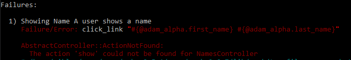

Showing Names
==================================================


## Table of Content
1. [Create git feature branch](#create-git-feature-branch)
2. [Create RSpec feature specification with successful scenario](#create-rspec-feature-specification-with-successful-scenario)
  1. [Add show action to the controller](#add-show-action-to-the-controller)
  2. [Create the show view](#create-the-show-view)
3. [Update RSpec feature specification with negative scenario](#update-rspec-feature-specification-with-negative-scenario)
  1. [Add validation to the model](#add-validation-to-the-model)
  2. [Display validation errors](#display-validation-errors)
4. [Commit changes and merge into master branch](#commit-changes-and-merge-into-master-branch)


## Create a feature branch
Create a git feature branch.
```bash
git checkout -b showing-name
```

## Create feature specification with successful scenario
Create a new file called _showing_name_spec.rb_ and make sure it starts with the line `require "rails_helper"`. Add the steps and the expected results from the actions.
```ruby
require "rails_helper"

RSpec.feature "Showing Name" do
  before do
    Name.delete_all
    @adam_alpha = Name.create(first_name: "Adam", last_name: "Alpha")
    @bertil_bravo = Name.create(first_name: "Bertil", last_name: "Bravo")
    @adam_charlie = Name.create(first_name: "Adam", last_name: "Charlie")
    @cesar_charlie = Name.create(first_name: "Cesar", last_name: "Charlie")
  end

  scenario "A user shows a name" do
    visit "/"
    click_link "#{@adam_alpha.first_name} #{@adam_alpha.last_name}"

    expect(page).to have_content("#{@adam_alpha.first_name} #{@adam_alpha.last_name}")
    expect(page).to have_content(@adam_alpha.created_at.strftime("%d %B, %Y"))
    expect(page).to have_content(@adam_alpha.updated_at.strftime("%d %B, %Y"))
  end
end
```

Run RSpec and address each error as they occur.
```bash
rspec spec/features/creating_name_spec.rb
```


### Add the show action to the controller
Running RSpec gives us the error:
```bash
Failure/Error: click_link "#{@adam_alpha.first_name} #{@adam_alpha.last_name}"
AbstractController::ActionNotFound:
  The action 'show' could not be found for NamesController"
```


To address this, add the `show` action for the controller, _app/controllers/names_controller.rb_
```ruby
def show
  @name = Name.find(params[:id])
end
```

### Create the show view
Running RSpec again gives us the next error:
```bash
Failure/Error: click_link "#{@adam_alpha.first_name} #{@adam_alpha.last_name}"
ActionController::UnknownFormat:
  NamesController#show is missing a template for this request format and variant.

```


To address this, create the file _app/views/names/show.html.erb_. Specific _Bootstrap_ classes are used for styling.
```ruby
<name class="detail-name">
  <h1 class="full-name">
    <%= "#{@name.first_name} #{@name.last_name}" %>
  </h1>

  <div class="admin">
    <p>Created</p>
    <div class="glyphicon glyphicon-calendar" id="name-created-date">
      <small>
      <%= @name.created_at.strftime("%d %B, %Y") %>
      </small>
    </div>
    <div class="glyphicon glyphicon-user" id="name-created-by">
      <small>
      <%= "Niklas Bergstrom" %>
      </small>
    </div>

    <br>
    <p>Updated</p>
    <div class="glyphicon glyphicon-calendar" id="name-created-date">
      <small>
      <%= @name.updated_at.strftime("%d %B, %Y") %>
      </small>
    </div>

    <div class="glyphicon glyphicon-user" id="name-updated-by">
      <small>
        <%= "Admin" %>
      </small>
    </div>
  </div>
</name>
```

## Update RSpec feature specification with negative scenario
Create a new folder _spec/requests_ and create the file _names_spec.rb_ and add a negative scenario.
```ruby
require 'rails_helper'
RSpec.describe "Names", type: :request do
  before do
    Name.delete_all
    @adam_alpha = Name.create(first_name: "Adam", last_name: "Alpha")
  end

  describe 'GET /names/:id' do
    context 'with existing name' do
      before { get "/names/#{@adam_alpha.id}" }
      it "handles existing names" do
        expect(response.status).to eq 200
      end
    end
    context 'with non-existing name' do
      before { get "/names/xxxxx" }
      it "handles non-existing name" do
        expect(response.status).to eq 302
        flash_message = "The name you are looking for could not be found"
        expect(flash[:alert]).to eq flash_message
      end
    end
  end
end
```

### Add validation to model
Running RSpec gives the error:
```bash
Failure/Error: @name = Name.find(params[:id])
ActiveRecord::RecordNotFound:
  Couldn't find Name with 'id'=xxxxx
```


Since the solution may not only apply to the name show action, we have to implement it in the application controller. To address this, update the file _app/controllers/application_controller.rb_ to be rescued from record not found errors.
```ruby
class ApplicationController < ActionController::Base
  rescue_from ActiveRecord::RecordNotFound, with: :resource_not_found

  protected

  def resource_not_found
  end
end
```
The resource_not_found method is empty because we will override it in the individual controllers as necessary.
Update the _names_controller.rb_.
```ruby
protected

  def resource_not_found
    message = "The name you are looking for could not be found"
    flash[:alert] = message
    redirect_to root_path
  end
```

### Display validation errors
Running RSpec gives the error:
```bash
Failure/Error: expect(page).to have_content("Name has been created")
  expected to find text "Name has been created" in "New Name"
```


It is the same error as before since we are not displaying the errors. To address this, update the _new.html.erb_ file to display the validation errors.
```ruby
<h3 class="text-center">Adding New Name</h3>
<div class="row">
  <div class="col-md-12">
    <%= form_for(@name, :html => {class: "form-horizontal", role: "form"}) do |f| %>
    <% if @name.errors.any? %>
      <div class="panel panel-danger col-md-offset-1">
        <div class="panel-heading">
          <h2 class="panel-title">
            <%= pluralize(@name.errors.count, "error") %>
            prohibited this name from being saved: </h2>
            <div class="panel-body">
              <ul>
                <% @name.errors.full_messages.each do |msg| %>
                <li>
                  <%= msg %>
                </li>
                <% end %>
              </ul>
            </div>
          </div>
        </div>
      <% end %>
```

## Commit the changes and merge into master branch
Check the _Git_ status and commit the updated files.
```bash
git status
git add -A
git commit -m "Implementing creating name functionality"
```

Checkout the _master_ branch and merge the changes.
```bash
git checkout master
git merge creating-name
git push
```

View a colourful log of the git branches and the commits.
```bash
git log --graph --oneline --decorate  
```
