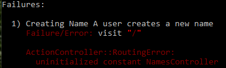
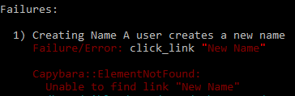
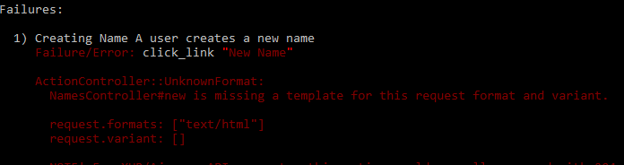
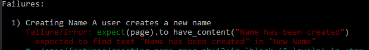

Special Occasions App
==================================================

##  Creating the Special Occasions App
Move to the working directory and create a new application. Use the `-T` flag to skip the testing framework in order to use _RSpec_
```bash
rails new special_occasions_app -T
```
Move to the application folder and run the _Bundler_ to install the _gems_
```bash
cd special_occasions_app
bundle install
```
Start the server
```bash
rails server
```

View the local application in your browser `http://localhost:3000/`

##  RSpec and Capybara
###  Installing RSpec and Capybara
Install _RSpec_
```bash
sudo apt install ruby-rspec-core
```
Add _RSpec_ and _Capybara_ to the _Gemfile_
```ruby
group :development, :test do
  gem 'rspec-rails', '~> 3.9'
  gem 'byebug', platforms: [:mri, :mingw, :x64_mingw]
end

group :test do
  gem 'capybara', '~> 3.29'
end
```
Run the _Bundler_ to install the new gems
```bash
bundle install
```

### Adding RSpec to the project
Run the generator to install _RSpec_ to the project
```bash
rails generate rspec:install
```
Generate an RSpec stub for the project
```bash
bundle binstubs rspec-core
```
Create a _feature_ folder under the _spec_ folder
```bash
mkdir spec/features
```

## Guard
### Adding Guard to the project
Add _Guard_ gems to the _Gemfile_
```ruby
group :development do
  gem 'web-console', '>= 3.3.0'
  gem 'guard', '~> 2.14.0'
  gem 'guard-rspec', '~> 4.7.2'
  gem 'guard-cucumber', '~> 2.1.2'
end
```

Run the _Bundler_ to install the new _gems_
```bash
bundle install
```

Initialize _Guard_ with the command:
```bash
guard init
```

Generate an Guard stub for the project
```bash
bundle binstubs guard
```

Initialize _Cucumber_ with the command:
```bash
cucumber --init
```

Update the _Guardfile_ by adding watches under the _Rails files_, _Rails config changes_ and _Capybara features specs_
```ruby
# Rails files
rails = dsl.rails(view_extensions: %w(erb haml slim))
dsl.watch_spec_files_for(rails.app_files)
dsl.watch_spec_files_for(rails.views)

watch(%r{^app/controllers/(.+)_(controller)\.rb$})  { "spec/features" }
watch(%r{^app/models/(.+)\.rb$})  { "spec/features" }
watch(rails.controllers) do |m|
  [
    rspec.spec.call("routing/#{m[1]}_routing"),
    rspec.spec.call("controllers/#{m[1]}_controller"),
    rspec.spec.call("acceptance/#{m[1]}")
  ]
end

# Rails config changes
watch(rails.spec_helper)     { rspec.spec_dir }
watch(rails.routes)          { "spec" } # { "#{rspec.spec_dir}/routing" }
watch(rails.app_controller)  { "#{rspec.spec_dir}/controllers" }

# Capybara features specs
watch(rails.view_dirs)     { "spec/features" } # { |m| rspec.spec.call("features/#{m[1]}") }
watch(rails.layouts)       { |m| rspec.spec.call("features/#{m[1]}") }
```

##  Git
###  Initializing the Git Repository
```bash
git init
git status
git add -A
git commit -m "Initializing Special Occasions App and setting up the environment"
```

### Pushing repository to GitHub
From GitHub, copy the URL and paste it on the command line to push your existing repository GitHub
```bash
git remote add origin git@github.com:BergstromDomain/special_occasions_app.git
git push -u origin master
git remote -v
```

## CRUD Names
### Creating Name
Create a topic branch
```bash
git checkout -b creating-name
```
#### Create feature specification
Create a new file called _creating_name_spec.rb_ and make sure it starts with the line `require "rails_helper"`
```ruby
require "rails_helper"

RSpec.feature "Creating Name" do
  scenario "A user creates a new name" do
    visit "/"

    click_link "Create name"

    fill_in "First Name", with: "Adam"
    fill_in "Last Name", with: "Alpha"
    click_button "Create Name"

    expect(page).to have_content("Name has been created")
    expect(page.current_path).to eq(root_path)
  end
end
```
#### Run RSpec and address errors
```bash
rspec spec/features/creating_name_spec.rb
```

#### Update the route file
The first error states:
```bash
Failure/Error: visit "/"
ActionController::RoutingError:
  No route matches [GET] "/"
```


Create a _root path_ by updating the _config/routes.rb_ file
```ruby
root to: "names#index"
```

#### Generate the controller
The next error states:
```bash
Failure/Error: visit "/",
ActionController::RoutingError:
  uninitialized constant NamesController
```



Use a generator to create a controller
```bash
rails g controller names index
```
Remove the _get 'names/index'_ line from the _config/routes.rb_ file


#### Create the index view
The next error states:
```bash
Failure/Error: click_link "New Name"
Capybara::ElementNotFound:
  Unable to find link "New Name"
```


Go to _app/views/names/index.html.erb_ and remove the existing content from it and add a link.
```ruby
<%= link_to "New Name", new_name_path %>
```


#### Update the route file
The next error states:
```bash
Failure/Error: <%= link_to "New Name", new_name_path %>
ActionView::Template::Error:
  undefined local variable or method 'new_name_path'
```


Add the path by adding `resources` to the _config/routes.rb_ file
```ruby
resources :names
```

#### Add the new action to the controller
The next error states:
```bash
Failure/Error: click_link "New Name"
AbstractController::ActionNotFound:
  The action "new" could not be found for NamesController"
```


Add the `new` action for the controller, _app/controllers/names_controller.rb_
```ruby
def new
end
```

#### Create the new view
The next error states:
```bash
Failure/Error: click_link "New Name"
ActionController::UnknownFormat:
  NamesController#new is missing a template for this request format and variant.
```



Create the file _app/views/names/new.html.erb_
```ruby
<h3 class="text-center">Adding New Name</h3>
<div class="row">
  <div class="col-md-12">
    <%= form_for(@name, :html => {class: "form-horizontal", role: "form"}) do |f| %>
      <div class="form-group">
        <div class="control-label col-md-1">
          <%= f.label :first_name %>
        </div>
        <div class="col-md-11">
          <%= f.text_field :first_name, class: "form-control", autofocus: true %>
        </div>
        <div class="form-group">
          <div class="control-label col-md-1">
            <%= f.label :last_name %>
          </div>
          <div class="col-md-11">
            <%= f.text_field :last_name, class: "form-control", autofocus: true %>
          </div>
      </div>
      <div class="form-group">
        <div class="col-md-offset-1 col-md-11">
          <%= f.submit "Create Name", class: "btn btn-primary btn-lg pull-right" %>
        </div>
      </div>
    <% end %>
  </div>
</div>
```

#### Add the new action to the controller
The next error states:
```bash
Failure/Error: <%= form_for(@name, :html => {class: "form-horizontal", role: "form"}) do |f| %>
ActionView::Template::Error:
  First argument in form cannot contain nil or be empty
```


Update the `new` action for the controller, _app/controllers/names_controller.rb_ by adding an instance variable.
```ruby
def new
  @name = Name.new
end
```

#### Generate model
The next error states:
```bash
Failure/Error: @name = Name.new
NameError:
  uninitialized constant NamesController::Name
```


Use a generator to create a model. __Note__ By convention, model names are singular and controller names are plural
```bash
rails g model name first_name:string  last_name:string full_name:string
```

Review and update the migration file _db/migrate/[TIMESTAMP]_create_names.rb_

#### Run the migration
Run the migration to create a database
```bash
rails db:migrate
```

#### Add the create action to the controller
The next error states:
```bash
Failure/Error: click_button "Create Name"
AbstractController::ActionNotFound:
  The action 'create' could not be found for NamesController
```


Add the `create` action for the controller as well as the __private__ `name_params` method
```ruby
def create
  @name = Name.new(name_params)
  if @name.save
    flash[:sucess] = "The name has been created"
    redirect_to root_path
  else
    flash.now[:danger] = "The name has not been created"
    render :new
  end
end

private
  def name_params
    params.require(:name).permit(:first_name, :last_name)
  end
```

#### Add flash to the application
The next error states:
```bash
Failure/Error: expect(page).to have_content("Name has been created")
  expected to find text "Name has been created" in "New Name"
```


It can’t find the flash message. Add flash messaging to the _app/views/layouts/application.html.erb_ file:
```ruby
<body>
  <% flash.each do |key, message| %>
    <div class="text-center alert alert-<%= key == 'notice'? 'success': 'danger' %>">
      <%= message %>
      </div>
  <% end %>
  <%= yield %>
</body>
```
#### Add Bootstrap for styling
In the Gemfile add the following gems:
```ruby
gem 'bootstrap-sass', '~> 3.4', '>= 3.4.1'
gem 'autoprefixer-rails', '~> 9.7', '>= 9.7.2'
```
Run `bundle install`

Create a new file _app/assets/stylesheets/custom.css.scss_ and add the following to it:
@import "bootstrap-sprockets";
@import "bootstrap";

Update the file _app/assets/javascripts/application.js_ by adding the line
```java script
//= require bootstrap-sprockets
```

#### Add a navigation bar
Edit the file _app/views/layouts/application.html.erb_ and add a navigation bar in the body tag:
```ruby
<body>
  <header role="banner">
    <nav class="navbar navbar-default navbar-fixed-top" role="navigation">
      <div class="container-fluid">
        <div class="navbar-header">
          <button type="button" class="navbar-toggle" data-toggle="collapse"
          data-target="#bs-example-navbar-collapse-1">
          <span class="icon-bar"></span>
          <span class="icon-bar"></span>
          <span class="icon-bar"></span>
        </button>
        <%= link_to "Niklas", root_path, class: "navbar-brand" %>
      </div>
      <div class="navbar-collapse collapse" id="bs-example-navbar-collapse-1">
        <ul class="nav navbar-nav">
          <li class="active"><%= link_to "Lifestyle Events App", root_path %></li>
        </ul>
      </div>
    </div>
  </nav>
</header>
<div class="container">
  <div class="row">
    <div class="col-md-12">
      <% flash.each do |key, message| %>
      <div class="text-center alert alert-<%= key == 'notice'? 'success': 'danger' %>">
        <%= message %>
      </div>
      <% end %>
      <%= yield %>
    </div>
  </div>
</div>
</body>
```
__Note:__ This caused the error: `ExecJS::ProgramError in LifestyleEventTypes#index
identifier '(function(opts, pluginOpts) {return eval(process' undefined
`

The solution I used was to comment out the `duktape` gem from the _Gemfile_

#### Adding validation
Update the file _models/lifestyle_event_type.rb_ to include validation and sort order
```ruby
validates :title, presence: true
default_scope { order(created_at: :desc) }

```

##  Configure RSpec

####################################################################################################
##  Configure RSpec
####################################################################################################

# Update .rspsec
--color
--require spec_helper
--format progress
--no-profile
--no-fail-fast
--order defined


####################################################################################################
##  Add the resources to the routes.rb file
####################################################################################################

Rails.application.routes.draw do
  root to: "lifestyle_events#index"

  resources :lifestyle_events
end


####################################################################################################
##  Generating the Lifestyle Event Model
####################################################################################################

rails generate model lifestyle_event name:string date:string type:string


####################################################################################################
##  Add create action to the controller
####################################################################################################

def create
  @lifestyle_event = LifestyleEvent.new(lifestyle_event_params)
  @lifestyle_event.save
  flash[:success] = "Lifestyle event has been created"
  redirect_to lifestyle_events_path
end

#  Add flah message to the application


####################################################################################################
##  Adding styling with Bootstrap
####################################################################################################

# Update Gemfile
# Add gem bootstrap-sass
# Add gem autoprefixer-rails

bundle install


####################################################################################################
##  Creating a custom.css.scss stylesheet file
####################################################################################################

@import "bootstrap-sprockets";
@import "bootstrap";


####################################################################################################
##  Copy a navbar template from Bootstrap
####################################################################################################

# Add the navigation bar to application.html.erb

s
